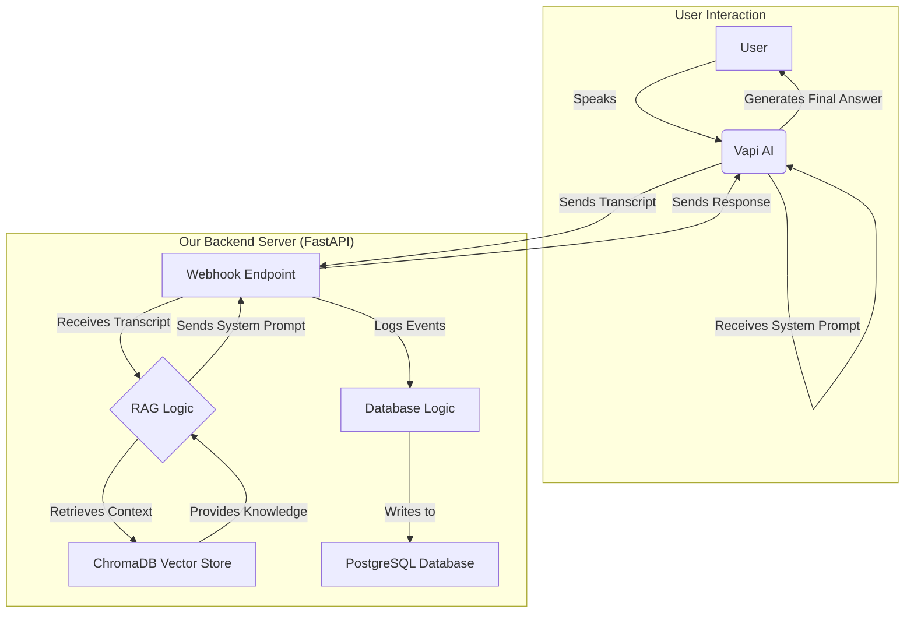

# AI Voice Agent with Dynamic RAG and Conversation Logging

This project is a sophisticated conversational AI voice agent that engages in real-time, spoken conversations. It leverages a dynamic, per-turn Retrieval-Augmented Generation (RAG) pipeline to provide context-aware answers and logs all communication details to a PostgreSQL database.

## Core Technologies

*   **Backend API:** FastAPI
*   **Voice & Conversation:** Vapi AI
*   **Language Model:** OpenAI (GPT-4o)
*   **RAG Pipeline:** LangChain
*   **Vector Store:** ChromaDB (for local knowledge bases)
*   **Database:** PostgreSQL (for conversation logging)
*   **Web Scraping:** Selenium & BeautifulSoup
*   **Orchestration:** Python

## Architecture

The system is designed for real-time context injection and robust logging.



### How It Works

1.  **Vapi AI:** Manages the live phone call, handling real-time speech-to-text (STT) and text-to-speech (TTS).
2.  **Webhook:** Vapi sends a notification (a webhook) to our FastAPI server every time the user finishes speaking.
3.  **Context Retrieval:** Our server receives the user's speech, queries the **ChromaDB vector store** to find relevant documents from the specific business's knowledge base.
4.  **Dynamic Prompting:** The server injects the retrieved documents into a new system prompt and sends it back to Vapi.
5.  **Final Answer Generation:** Vapi uses its own powerful LLM (e.g., GPT-4o) to generate a final answer, guided by the context we provided. This makes the agent's response highly relevant.
6.  **Database Logging:** Throughout the call, our server also receives events (`status-update`, `end-of-call-report`) and logs all details—call metadata, final transcript, etc.—to our **PostgreSQL database**.

## Setup and Installation

Follow these steps to set up and run the project.

### Step 1: Environment and API Keys

1.  **Clone the Repository:**
    ```bash
    git clone <your-repository-url>
    cd <your-repository-name>
    ```

2.  **Set Up Virtual Environment:**
    ```bash
    python3 -m venv venv
    source venv/bin/activate
    ```

3.  **Install Dependencies:**
    ```bash
    pip install -r requirements.txt
    ```

4.  **Create `.env` file:** Create a file named `.env` in the project root. This file will store all your secret keys. **Do not commit this file to Git.**

5.  **Add API Keys and Database Credentials:** Open the `.env` file and add the following keys. You will get the database credentials in the next step.
    ```env
    # Vapi API Key
    VAPI_PUBLIC_KEY="<your-vapi-key>"

    # OpenAI API Key
    OPENAI_API_KEY="sk-..."

    # Supabase/PostgreSQL Credentials
    DB_HOST="<your-db-host>"
    DB_PORT="5432"
    DB_NAME="postgres"
    DB_USER="postgres"
    DB_PASS="<your-db-password>"

    # (Optional) LangSmith for AI Observability
    LANGCHAIN_TRACING_V2="true"
    LANGCHAIN_API_KEY="<your-langsmith-api-key>"
    LANGCHAIN_PROJECT="<your-langsmith-project-name>" # e.g., "AI Voice Agent"
    ```

### Step 2: Set Up the PostgreSQL Database (Supabase)

We use a PostgreSQL database to store call logs and transcripts. A free Supabase project is the easiest way to get this.

1.  **Create a Supabase Project:**
    *   Go to [supabase.com](https://supabase.com) and create a new project.
    *   Save the **database password** they provide.

2.  **Get Connection Info:**
    *   In your Supabase project, go to **Project Settings** > **Database**.
    *   Under **"Connection string"**, find the `psql` connection string.
    *   Copy the `Host`, `Port`, `Database name`, `User`, and `Password` into your `.env` file.

3.  **Create the Database Tables:**
    *   In the Supabase dashboard, go to the **SQL Editor**.
    *   Open the `src/database/schema.sql` file from this project, copy its entire contents, paste it into the Supabase SQL Editor, and click **"Run"**. This will create the `calls` and `transcripts` tables.
    *   Run the following two `ALTER TABLE` commands in the SQL Editor to ensure the columns are the correct size:
        ```sql
        ALTER TABLE calls
        ALTER COLUMN status TYPE VARCHAR(50);

        ALTER TABLE transcripts
        ALTER COLUMN speaker TYPE VARCHAR(20);
        ```

### (Optional) Step 3: Configure AI Observability with LangSmith

While the Supabase database logs the final outcomes of calls, **LangSmith** is a powerful tool for developers to debug the AI's "thought process." It lets you trace the internal steps of your RAG chain (e.g., which documents were retrieved, what prompt was used) to understand *why* the agent gave a specific answer. This step is highly recommended for development.

1.  **Create a LangSmith Account:**
    *   Go to [langsmith.com](https://www.langchain.com/langsmith) and sign up.
2.  **Create a Project:**
    *   Once in the dashboard, create a new project (e.g., "AI Voice Agent").
3.  **Generate an API Key:**
    *   Go to the **Settings** > **API Keys** section and create a new key.
4.  **Update `.env` file:**
    *   Go back to your `.env` file and add the three `LANGCHAIN_...` variables, pasting in your new API key and the name of the project you created.

### Step 4: Train the Agent (Data Ingestion)

Before the agent can answer questions about a specific business, you must train it on that business's knowledge.

1.  **Find a Website:** Get the URL of the website you want the agent to learn from.
2.  **Run the Ingestion Script:** Run the following command in your terminal, replacing the URL and giving the business a unique name.
    ```bash
    python3 src/data_ingestion/ingest_data.py <https://example.com> "Example Business Name"
    ```
    This script will scrape the website, create vector embeddings, and save them to a new collection in the `chroma_db` directory. The collection name will be a sanitized version of the business name (e.g., `examplebusinessname`).

### Step 5: Run the Agent

Now you are ready to make a call.

1.  **Start the Backend Server:**
    Open a terminal and run the FastAPI server.
    ```bash
    python3 -m uvicorn src.core_api.main:app --reload
    ```

2.  **Expose the Server with Ngrok:**
    Open a *second* terminal and run ngrok.
    ```bash
    ngrok http 8000
    ```
    Copy the public `https://...ngrok-free.app` URL that ngrok provides.

3.  **Configure Vapi Dashboard:**
    *   Go to your assistant in the [Vapi Dashboard](https://vapi.ai/dashboard).
    *   Go to the **"Advanced"** tab.
    *   In the **"Server URL"** field, paste your ngrok URL. **Crucially, you must append the business name and webhook path.** For example:
        `https://<your-ngrok-url>/examplebusinessname/vapi-webhook`
    *   Go to the **"Model"** tab and ensure an OpenAI model (like GPT-4o) is selected.
    *   **Publish** your assistant to save the changes.

4.  **Talk to the Agent:**
    Click the **"Talk to Assistant"** button in the Vapi dashboard to start a conversation. The agent will now use your local server and its knowledge base to answer questions.

## Project Structure
```
.
├── chroma_db/        # Local ChromaDB vector store
├── src/
│   ├── core_api/
│   │   └── main.py     # FastAPI server, webhook logic, and RAG pipeline
│   ├── data_ingestion/
│   │   ├── ingest_data.py # Script to scrape websites and train the agent
│   │   └── scraper.py     # (Legacy) Original scraping utility
│   ├── database/
│   │   ├── database.py # Functions for interacting with the PostgreSQL DB
│   │   └── schema.sql  # SQL schema for the database tables
│   └── ...
├── .env.example      # Example environment file
├── README.md
├── requirements.txt
└── run_vapi.py       # (Legacy) Script to initiate calls via API
``` 