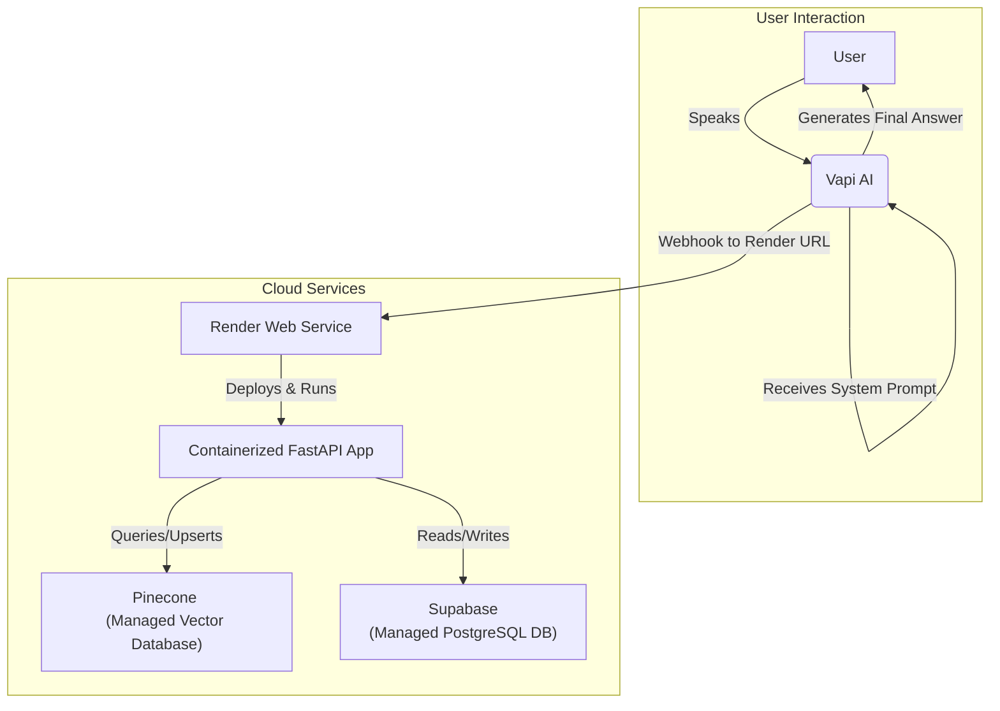

# AI Voice Agent with Cloud-Native RAG and Conversation Logging

This project is a sophisticated conversational AI voice agent that engages in real-time, spoken conversations. It leverages a cloud-native, per-turn Retrieval-Augmented Generation (RAG) pipeline to provide context-aware answers and logs all communication details to a PostgreSQL database.

This backend is designed to be deployed as a containerized web service on **Render**.

## Core Technologies

*   **Backend API:** FastAPI
*   **Cloud Platform:** Render
*   **Voice & Conversation:** Vapi AI
*   **Language Model:** OpenAI (GPT-4o)
*   **RAG Pipeline:** LangChain
*   **Vector Store:** Pinecone (Cloud-based)
*   **Database:** PostgreSQL (e.g., Supabase)
*   **Web Scraping:** Selenium & BeautifulSoup
*   **Orchestration & Containerization:** Python & Docker

## Architecture

The system is designed for a scalable, production-ready cloud environment.



### How It Works

1.  **Vapi AI:** Manages the live phone call, handling real-time speech-to-text (STT) and text-to-speech (TTS).
2.  **Webhook to Render:** Vapi sends a notification (a webhook) to our **FastAPI application running on Render** every time the user finishes speaking.
3.  **Context Retrieval from Pinecone:** The application receives the user's transcript, queries the **Pinecone vector index** to find relevant documents from the specific business's knowledge base (using a namespace).
4.  **Dynamic Prompting:** The server injects the retrieved documents into a new system prompt and sends it back to Vapi.
5.  **Final Answer Generation:** Vapi uses its powerful LLM (e.g., GPT-4o) to generate a final answer, guided by the context we provided.
6.  **Database Logging:** Throughout the call, the server also receives events (`status-update`, `end-of-call-report`) and logs all details—call metadata, full transcript, etc.—to our **PostgreSQL database** (e.g., Supabase).

## Setup and Deployment

This project is designed to be deployed as a Dockerized web service on Render.

### Step 1: Set Up Cloud Services

1.  **Pinecone:**
    *   Sign up for a [Pinecone](https://www.pinecone.io/) account.
    *   Create a new index. Give it a name (e.g., `voice-agent-data`).
    *   Set the **Dimension** to **`512`** and the **Metric** to **`Cosine`**.
    *   From the "API Keys" section, note your **API Key** and **Environment** name.

2.  **PostgreSQL Database (Supabase):**
    *   Create a free project on [Supabase](https://supabase.com).
    *   Go to **Project Settings > Database** and get your connection credentials (`Host`, `Port`, `Password`, etc.).
    *   Go to the **SQL Editor**, paste the contents of `src/database/schema.sql`, and run it to create the necessary tables.

### Step 2: Set Up Your GitHub Repository

1.  Push this project's code to your own **private** GitHub repository.
2.  Ensure the `Dockerfile` in the root of the project is included.

### Step 3: Deploy to Render

1.  Create a new **Web Service** on [Render](https://render.com/) and connect it to your new GitHub repository.
2.  Set the **Runtime** to **`Docker`**.
3.  Choose the **Free** instance type.
4.  Under **Environment Variables**, add the following, using the credentials you collected in Step 1:
    *   `PINECONE_API_KEY`
    *   `PINECONE_ENVIRONMENT`
    *   `OPENAI_API_KEY`
    *   `DB_HOST`
    *   `DB_PORT`
    *   `DB_NAME`
    *   `DB_USER`
    *   `DB_PASS`
    *   (Optional) Add your `LANGCHAIN_*` variables for observability.
5.  Click **"Create Web Service"**. Render will build and deploy your application. The public URL will be shown on your dashboard (e.g., `https://your-app-name.onrender.com`).

### Step 4: Train the Agent (Data Ingestion)

Before the agent can answer questions, you must train it on a business's knowledge. This is done by running the ingestion script locally.

1.  **Set Up Local Environment:**
    *   Create a `.env` file in the project root and add your `PINECONE_API_KEY` and `PINECONE_ENVIRONMENT` to it.
    *   Install dependencies: `pip3 install -r requirements.txt`.
2.  **Run the Ingestion Script:** Run the following command in your terminal, replacing the URL and giving the business a unique name. This name will become the `namespace` in Pinecone.
    ```bash
    python3 src/data_ingestion/ingest_data.py "https://example.com" "Example Business Name"
    ```
    This script will scrape the website, create vector embeddings, and save them to your cloud Pinecone index.

### Step 5: Connect and Talk to the Agent

1.  **Configure Vapi Dashboard:**
    *   Go to your assistant in the [Vapi Dashboard](https://vapi.ai/dashboard).
    *   Go to the **"Advanced"** tab.
    *   In the **"Server URL"** field, paste your Render URL. **Crucially, you must append the business name (namespace) and webhook path.** For example:
        `https://<your-render-url>/examplebusinessname/vapi-webhook`
    *   **Publish** your assistant.
2.  **Talk to the Agent:**
    Click the **"Talk to Assistant"** button in the Vapi dashboard to start a conversation.

## Project Structure
```
.
├── src/
│   ├── core_api/
│   │   └── main.py     # FastAPI server, webhook logic, and RAG pipeline
│   ├── data_ingestion/
│   │   └── ingest_data.py # Script to scrape websites and train the agent
│   ├── database/
│   │   ├── database.py # Functions for interacting with the PostgreSQL DB
│   │   └── schema.sql  # SQL schema for the database tables
│   └── ...
├── .gitignore
├── Dockerfile        # Instructions for building the production container
├── README.md
└── requirements.txt
``` 